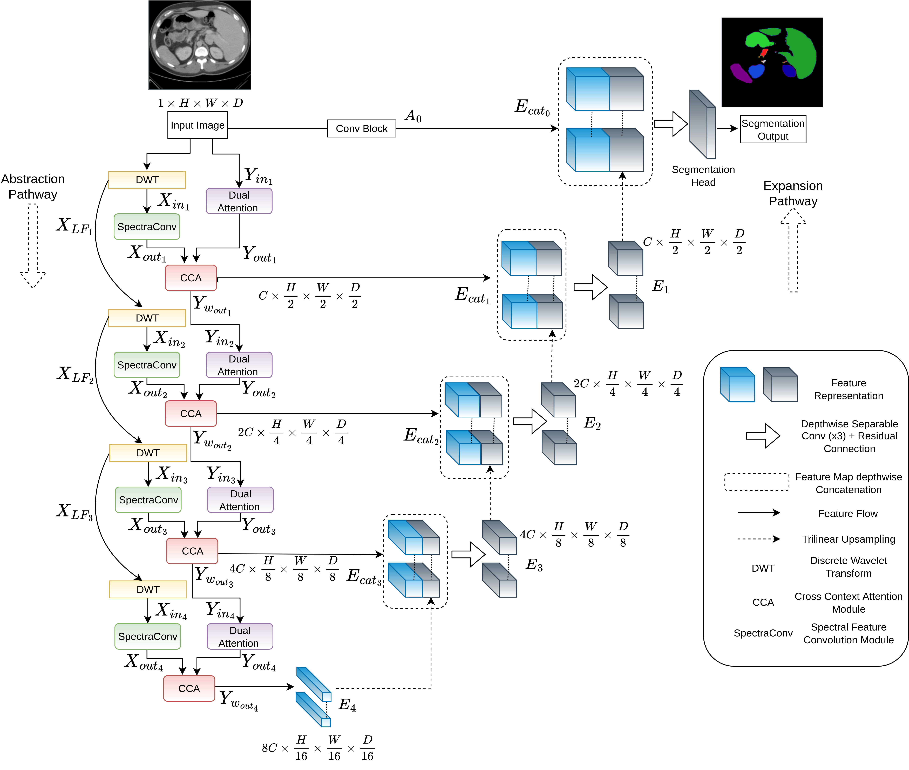

## [Wavelet-infused convolution-transformer for efficient segmentation in medical images](https://ieeexplore.ieee.org/abstract/document/10897783)
:pushpin: This is an official PyTorch implementation of **Wavelet-Infused Convolution-Transformer for Efficient Segmentation in Medical Images**

> [**Wavelet-infused convolution-transformer for efficient segmentation in medical images**](https://ieeexplore.ieee.org/abstract/document/10897783)<br>
> Pallabi Dutta, [Sushmita Mitra](https://www.isical.ac.in/~sushmita/)\* and Swalpa Kumar Roy](https://swalpa.github.io/)<sup>✉</sup>,



**Abstract**: Recent medical image segmentation methods extract the characteristics of anatomical structures only from the spatial domain, ignoring the distinctive patterns present in the spectral representation. This study aims to develop a novel segmentation architecture that leverages both spatial and spectral characteristics for better segmentation outcomes. This research introduces the wavelet-infused convolutional Transformer (WaveCoformer), a computationally effective framework to fuse information from both spatial and spectral domains of medical images. Fine-grained textural features are captured from the wavelet components by the convolution module. A transformer block identifies the relevant activation maps within the volumes, followed by self-attention to effectively learn long-range dependencies to capture the global context of the target regions. A cross-attention mechanism effectively combines the distinctive features acquired by both modules to produce a comprehensive and robust representation of the input data. WaveCoformer outperforms related state-of-the-art networks in publicly available Synapse and Adrenal tumor segmentation datasets, with a mean Dice score of 83.86% and 79%, respectively. The model is feasible for deployment in resource-constrained environments with rapid medical image analysis due to its computationally efficient nature and improved segmentation performance.

## 📚 Datasets

The Synapse dataset can be accessed from [https://doi.org/10.7303/syn3193805](https://doi.org/10.7303/syn3193805)
The Adrenal-ACC-Ki67-Seg dataset can be accessed from [https://www.cancerimagingarchive.net/collection/adrenal-acc-ki67-seg/](https://www.cancerimagingarchive.net/collection/adrenal-acc-ki67-seg/)

## 🛠 Setup
Installation of necessary Python packages using:
```
pip install requirements.txt

```
Structure of model directory:
```
model
   |----wavecoformer.py

```

## 📜Citation
If you like our work, please consider giving it a star ⭐ and cite us
```
@ARTICLE{dutta2025wavelet,
  author={Dutta, Pallabi and Mitra, Sushmita and Roy, Swalpa K.},
  journal={IEEE Transactions on Systems, Man, and Cybernetics: Systems}, 
  title={Wavelet-Infused Convolution-Transformer for Efficient Segmentation in Medical Images}, 
  year={2025},
  volume={55},
  number={5},
  pages={3326-3337},
  doi={10.1109/TSMC.2025.3539573}}
```
## 🎈 Acknowledgement

Part of this code is borrowed from [https://docs.monai.io/en/1.3.0/_modules/monai/networks/nets/swin_unetr.html]
